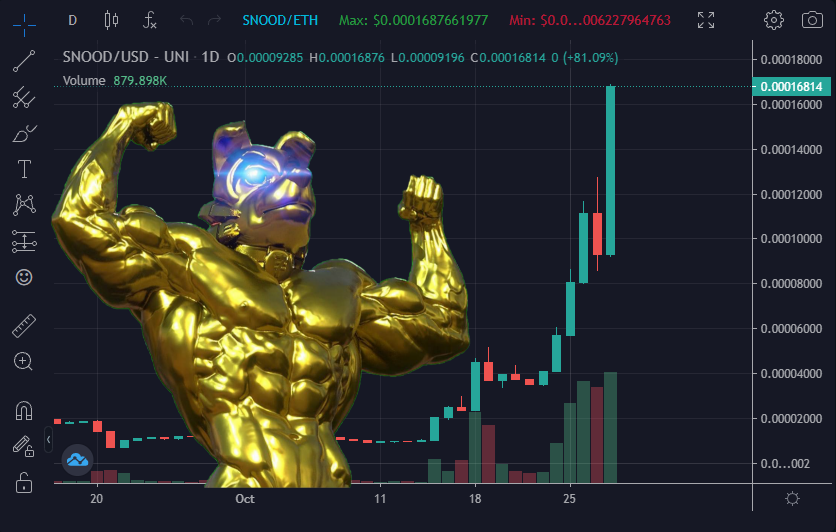

# 🐶 Overview

## Introduction

Schnoodle is a true trustless and progressive DeFi DAO that bridges key cryptocurrency concepts including meme, yield farming, NFTs, and multichain interoperability.

As an investor in Schnoodle, there are many opportunities for you to gain SNOOD tokens. Simply buy and hold (BARK algorithm), farm via the Moon Farming Platform, or earn via Dework.

Earn by Holding

Earn BARK rewards. This is not another token. This is SNOOD that is automatically added to your balance just by holding. Every time someone sells, you get some of their SNOOD.

Learn more [here](whitepaper/architecture.md#bark-algorithm).

Earn by Farming

Earn yield farming rewards. This is our comprehensive, fully automated, and algorithmic  Moon Farming Platform (MFP). The farming fund is constantly funded from sells (the Gamified Yield Incentivator or GYI), and you can choose how long to lock your tokens for which affects the APY you get.

Learn more [here](features/mfp.md).

Earn by Contributing

Earn by completing tasks. This is where Schnoodle as a DAO really comes into its own. Anyone can do work for Schnoodle provided you have the right skills and some time. Join our project on Dework and look for some open tasks to take on.

Go to our Dework space [here](https://app.dework.xyz/schnoodle-dao-1).

Schnoodle was launched in July 2021 by a team classically trained in software engineering and financial markets, and who have extensive commercial and corporate experience in marketing, engineering, and financial industries. Fully based across Europe (from UK to Georgia), most of us are married and have young children, and we're fully doxed.

Schnoodle uses bleeding edge decentralised technologies to form a fully trustless and permissionless ecosystem which we call the [Schnoodle Community Ecosystem](whitepaper/community-ecosystem.md) (SCE).

The **first major component** of the SCE is the [Foundations of Schnoodle](whitepaper/foundations-of-schnoodle.md) (FoS). This is comprised of two subcomponents:

1. The [Cornerstones of Schnoodle](whitepaper/foundations-of-schnoodle.md#cornerstones-of-schnoodle-cos) (CoS) are the Trustless Autonomous Governance (TAG) and Blockchain Automated Reward Kickbacks (BARK).
2. The [Four Pillars of Schnoodle](whitepaper/foundations-of-schnoodle.md#four-pillars-of-schnoodle-4pos) (4PoS) comprise our Price Support Mechanism (PSM), Moon Farming Platform (MFP), Fully Autonomous Bridge (FAB), and our NFT Platform (Moontron).

The **second major component** of the SCE is the [Utilities of Schnoodle](whitepaper/utilities-of-schnoodle.md) (UoS) which is growing constantly, and includes an eleemosynary feature and our SaaS systems which are in development. Our ultimate goal is to help other DAO projects utilise our innovative technology, and grow our DAO platforms through our SaaS systems.

## Our Story

> "What's past is prologue." ─ William Shakespeare. _The Tempest._

Schnoodle's story began when our founder, Jason Payne, also known within the community as Neo, realised that decentralised finance is the key to unlocking sustainable economies and enabling communities to grow and prosper together. However, Jason discovered a problem. The DeFi projects and DAOs on the market are not truly decentralised, and this needed to change.

At the time of launch in the summer of 2021, meme tokens were becoming increasingly popular, with some reaching incredible new heights never seen before in the world of crypto.

That’s when Jason came up with the idea of creating the world’s first truly decentralised, autonomous organisation using a meme backdrop to bootstrap initial adoption. After innovating the bleeding edge technology that created the foundations of our DAO today, Schnoodle Finance and our mascot Krypto were born!

Since the innovation started, it hasn’t stopped. With the release of update after update, our Moon Farming Platform and other disruptive technologies, Schnoodle quickly became the most advanced DAO project in existence.

Although it was great to be the only true DAO on the market, the Schnoodle core team soon realised that it's much more valuable to use our groundbreaking technology to help other DAOs reach their full potential.

This was when a new chapter began, and Schnoodle Finance was rebranded to what we're known as today, Schnoodle ĐAO. Being a meme token was never our true destiny, but it's a part of our story and is something that will always be remembered.

## Mission

Schnoodle is devoted to providing truly decentralised platforms for our community to interact with while helping other projects unlock their decentralised potential through our SaaS (Software as a Service) system.

Ultimately, we want to expand the scope of truly decentralised technology and work towards a more decentralised world where communities can work together and reach new heights.

We believe that decentralising organisations will increase innovation and creativity, allowing members to communicate effectively while working remotely. We aim to set an example of how fair working within a DAO can be, and showcase how powerful it can be to others worldwide.

## Philosophy

### What is a DAO?

In the real world (IRL), most organisations are run by one or more people who make all the decisions based on what they think is best. But, best for whom? Them, or the people affected by the organisation. This could be a company, a charity, a bank, or even a political body. Yes, there are shareholders and citizens who can vote on changes. But usually, there is a degree of opacity, and no one truly knows how deep that runs. And that opacity could hide a policy that allows the organisation to take drastic action in circumstances the community don't know about. In crypto, we call this a rug pull. In traditional organisations, they exist but are hidden. We've seen this happen many times throughout history, such as banks freezing the accounts of its customers in a crisis, or the government taking the land of its citizens using some obscure law or hidden policy.

A DAO is a Decentralized Autonomous Organization. The clue is in the acronym. A DAO aims to solve the problem of traditional organisations by taking control away from a centralised group of people, and using decentralised technology such as blockchain to ensure full transparency in the form of code (smart contracts). But it also goes a step further by autonomising the way the organisation is run by using code that powers the governance processes.

### The DAO Problem

The problem is that true DAOs do not exist, and most DAOs hijack this buzzword to promote themselves as as DAO. From an ecosystem perspective, they run on blockchain, and blockchains tend to run autonomously. However, from a business architecture perspective, they require manual fulfilment of governance through a centralised multisig group. That group must be trusted to be active. Where is the autonomy in that?

### Code is Law

We believe a DAO must satisfy the DATA equation:

$$
Decentralised+Autonomous=TrustlessArchitecture
$$

This means that the architecture of the business logic must itself be decentralised and autonomous, not just the ecosystem that it runs on (e.g., the Ethereum blockchain). This defines the nature of a true DAO: trustlessness. That does not preclude the existence of a trusted centralised element. But it creates a parity between the trustless and the trusted where the code is law, and the trusted group are passive overseers, not executors.

But don't forget, the membership of the trusted group is effectively governed by the code of the DAO as the owners and executors are stored in code and can be changed in code. That means the entire DAO runs by its code. But when an exceptional situation arises (such as a 51% attack or a critical opportunity), the elected trusted group can take action.

Schnoodle aims to fully respect the DATA equation, and this is enshrined in its technical architecture, which forms the first Cornerstone of Schnoodle, part of the Foundations of Schnoodle.


[foundations-of-schnoodle.md](whitepaper/foundations-of-schnoodle.md)

