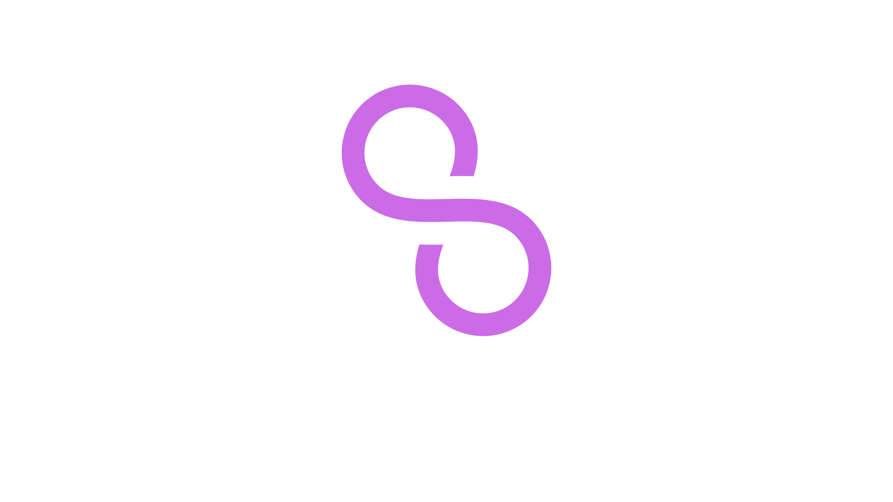
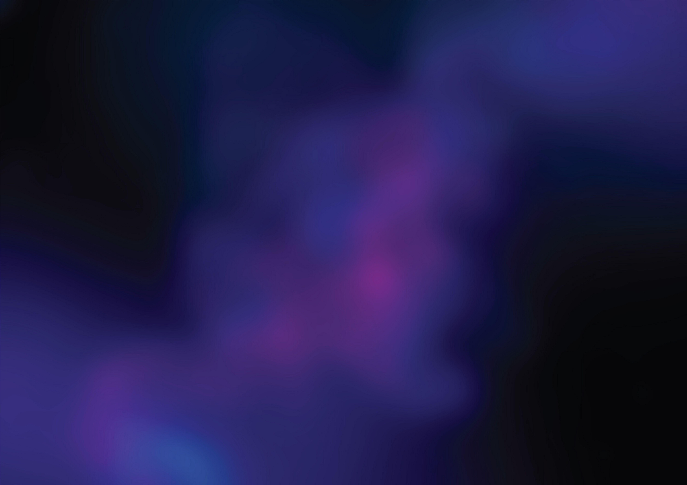

# 🧰 Toolkit

## Logo

 

<mark style="color:red;">**TODO: Logo with caption right**</mark>

### Concept

The logo is an "S" stylised in a way that makes one think of the infinity symbol. It contains two dog paw prints as a nod to Schnoodle's origins a dog-themed meme coin.

When used, it is essential that the Schnoodle logo remains perfectly legible and free from obstruction.

### Guidelines

These guidelines must be followed to ensure a consistent brand image and clear legibility throughout all applications. The logo must always be free from visual distractions. The minimum space around the logo has been defined. This visibly clear space should only change proportionally concerning the two possible logo variations.

* Do not stretch or deform the logo.
* Do not colour the logo with a gradient or any flat colour outside the brand colours.
* Do not place the logo on an image without using a contrasting colour.
* Do not outline the logo.
* Do not add any effects to the logo, like drop shadows or digitally produced metallic finishes.

#### Size and Typeface

All versions of the logo may be upscaled proportionally to any size. Downscaling is restricted to a minimum size to retain legibility.

* Web: 6.5 mm / 18 px
* Print: 20 mm
* Typeface: Archivo Black

### Examples of How to Use

<mark style="color:red;">**TODO**</mark>

### Examples of How Not to Use

<mark style="color:red;">**TODO**</mark>

## Colours

The Schnoodle brand colours have been intentionally chosen, so they should not be replaced or altered.

Using Colour Psychology, purple usually signifies wisdom, royalty and creativity. It is usually connected with wealth and prosperity, also a colour that means respect. When used for branding purposes, it is best correlated with "outside the box" brands, which is an excellent way to describe Schnoodle ĐAO.

When using these colours, it is paramount that there is enough contrast between them to allow maximum legibility.

The four gradients are composed of the brand colours and are the only gradients that should be used throughout the branding.

<mark style="color:red;">**TODO: Swatches and Gradients**</mark>

## Typography

The primary font for titles and **bold** texts for the Schnoodle brand is Archivo, in the style called Black.


Archivo - Google Fonts


The font used for all other texts is Montserrat.


Montserrat - Google Fonts


## Visuals

The Schnoodle brand visuals have been prepared with the idea to go precisely in line with how the brand wants to be perceived.

The icon style is also set with outlined icons, never filled, and used only in brand colours, gradients or black/white where necessary.

Icons and illustrations can be supplied by brand designers and illustrators when needed.

<mark style="color:red;">**TODO: Icons**</mark>

### Examples of Usage

   

## Mascot

The Schnoodle mascot is called Krypto, and the following template can be used for various angles when placing on memes or other visuals.

The Matrix theme is heavily used, not only visually, but also as part of the narrative illustrated in the whitepaper, memes posted on social media, the nickname of the founder, and more. The Matrix theme remains present in the brand and will continue to be around in memes throughout social media and the website.

         

  
