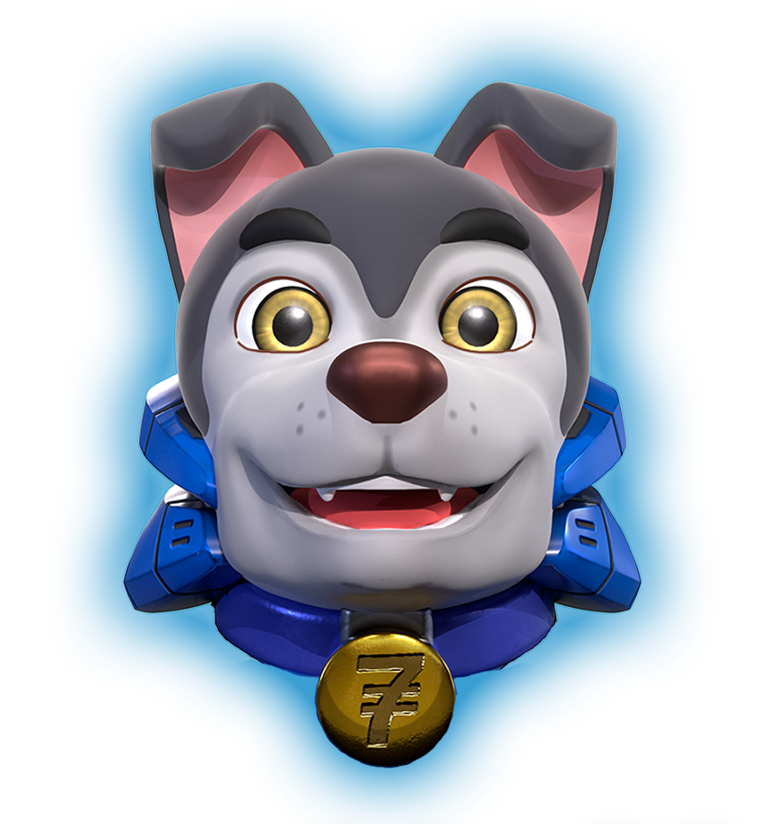

# 🗣 Voice

## Target Audience

Following the mission and vision of Schnoodle ĐAO, it is only appropriate to detail the type of audience our message will be directed to. Below can be found our main target audiences:

### Audience One (Token-Based)

* Male
* 18-30

#### Interests

* ETH/BSC
* Decentralised finance
* Virtual Hangouts
* Blockchain technology
* Memes

### Audience Two (Token-Based)

* Male
* 30-50

#### Interests

* ETH/BSC
* Decentralised finance
* Engineering and software development
* Long-term investments
* Project building

### Audience Three (NFT-Based)

* Male
* 18-30

#### Interests

* ETH/BSC
* NFTs
* Gaming
* Metaverse

### Audience Four (Women-Based)

Approaching women-based audiences can be made by reinforcing content through positive female models in the members of the Schnoodle team like Queen Lisa on Telegram. Sometimes we may generate content from her messages on Telegram, to attract this target audience. Another way is to mention noteworthy women in the crypto space such as Randi Zuckerberg, Gwyneth Paltrow, Reese Witherspoon, Mila Kunis, Helen Hai, etc.

* Female
* 18-30

#### Interests

* ETH/BSC
* NFTs
* Metaverse

## How do we want to be perceived?

* Sophisticated
* Advanced
* Light-hearted
* Futuristic
* Focused
* Unique

## Who speaks for Schnoodle?

Krypto’s name is the name of Superman's dog in the comics, while also being a reference to the word “crypto”, which is a proper adaptation, given the nature of the project and its scope. He possesses all the qualities of our audience at once while remaining impartial in tone when needed.

Krypto is highly focused, futuristic in his thinking, sophisticated in speech and delivery, advanced yet simple enough to be understood, lighthearted when needed, and fundamentally unique. Embracing both the spirit of our team and our audience, Krypto embodies the knowledge and passion for driving through and bringing Schnoodle to the audience in the best possible way.

The most attractive side of Krypto is his quality of making others trust him; his speech is captivating and magnetic, but with a sense of longevity and not the spur of the moment. He gives meaning to his words and always keeps his promises, a true alpha of the pack.

Sometimes the light-hearted side dominates the communication to lighten the mood when the market is volatile. At the same time, he is reassuring to the audience, bringing the attention back to what’s crucial.

Krypto’s passion in life is to make truly incredible things happen. He’s fascinated by the possibilities of technology and is a firm believer in blockchain and cryptocurrency as the future of global finance. He believes that true democratization and accessibility - whether in art, money or other assets - lies in these revolutionizing new fields. And he wants to be a driving force in that journey.

## How does Krypto communicate on the website?

The Schnoodle ĐAO website is where Krypto’s full-fledged personality is seen to shine. He details all the benefits of joining the project and can easily switch between his knowledgeable side and his more fun communication style. His language establishes him as a true expert and a true boundary-breaker, with his ambitious and innovative plans for the future of the Schnoodle ĐAO. Krypto's character's sophisticated, futuristic, and reliable attributes come across throughout the website, and whoever listens to him will feel as if they are about to take a fascinating and different kind of journey.

## How does Krypto communicate on social media channels?

On all social media channels, Krypto is busy building and maintaining a community for Schnoodle, finding those other people who are as convinced of and excited by blockchain, DeFi, cryptocurrencies, NFTs, and memes as much as he is. The people who want to be part of the amazingly enterprising journey he’s captaining with Schnoodle ĐAO. He’s at his highest potential of engagement and conversational level here, although this doesn’t take from him continuing to establish himself as an expert authority on the topics.

He is highly focused on the conversations, spreads trust, and listens to his community’s voice with interest. There is no topic he shies away from, even getting personal at times, especially on the more community-related channels like Discord and Telegram, where being candid is often rewarded. This is what makes him truly unique and advanced; he can incorporate both the nerdy side of him and his outgoing personality in a fun way for everyone.
