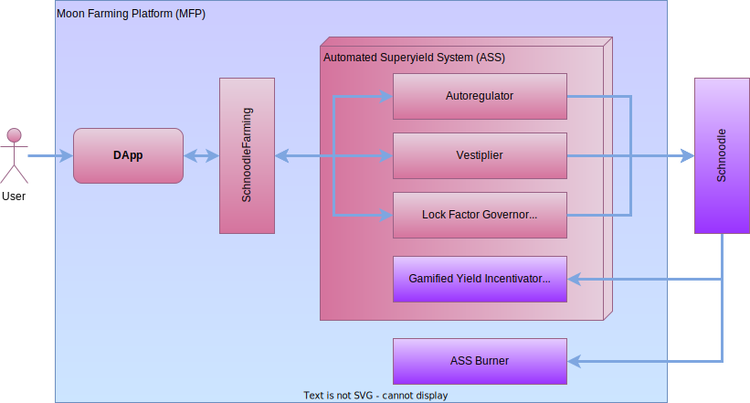
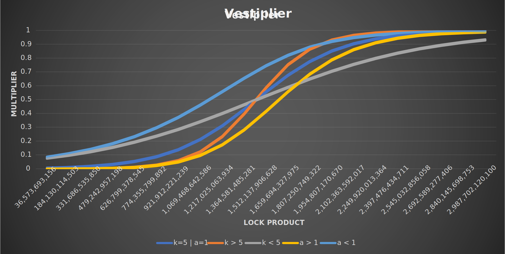

# 🏆 Moon Farming Platform

Schnoodle's revolutionary new yield farming concept, introduced in SchnoodleV7, is more advanced than any other yield farming platform in existence, which is why we call it the Moon Farming Platform (MFP). It comprises a DApp where holders may farm their tokens, and a smart contract backend which uses our bespoke Automated Superyield System (ASS) technology. Our amazing ASS is based on three subcomponents:

* **Autoregulator:** This ensures that yield farming rewards are apportioned based on the ratio of each yield farmer's cumulative deposit to the cumulative total of all deposits. This provides the gross reward, which autoregulates via the `_newCumulativeTotal` function called on each farming activity.
* **Vestiplier:** This is a function of the deposit amounts, vesting blocks and unbonding blocks of all yield farmers which is used to calculate a multiplier based on a [logistic function](https://en.wikipedia.org/wiki/Logistic\_function).
* **Gamified Yield Incentivator (GYI):** This is the sister functionality of the Gamified HODL Incentivator (GHI) that is part of the Price Support Mechanism (PSM). It is a mechanism whereby the farming fund that is used to reward yield farmers is effectively supplied from a 4% fee (the sow rate) on all sells.
* **Lock Factor Governor (LFG):** This comprises two settings on the smart contract, namely `_vestingBlocksFactor` and `_unbondingBlocksFactor` which are permil (‰) values. These may be changed via the `changeVestingBlocksFactor` and `changeUnbondingBlocksFactor` functions. The effect of these is to adjust the vesting blocks and unbonding blocks settings of all deposits dynamically at the point of withdrawal (`withdraw` function).

## Automated Superyield System

The Vestiplier uses a highly sophisticated algorithm that calculates the yield farming reward using the weighted average of the product of the vesting blocks and unbonding blocks (the lock product) where the deposit amount is the weight. The delta between the resultant lock product weighted average (LPWA) and any given deposit's lock product value is then used in a logistic formula to form a sigmoid curve which is used to calculate a multiplier between 0 and 1. This algorithm ensures that the sigmoid curve is always centred around a fair weighted lock product value to provide a fair multiplier which is then applied to the gross reward to give a final net reward that the yield farmer receives upon withdrawing their deposit.

The logistic formula is:

$$
1 ÷ (1 + e⁻ᵏ⁰⁽ˣ⁻ˣ⁰⁾)ᵃ
$$

* _x_ is the lock product of any given deposit.
* _x₀_ is the LPWA.
* _k₀_ is the ratio of _k_ to the LPWA which controls the shape of the curve. The larger _k_ is, the steeper the curve.
* _a_ controls the shift of the curve. The larger _a_ is, the more right-shifted the curve.

The sigmoid curve parameters _k_ and _a_ may be tweaked via the `changeSigmoidParams` function depending on the general farm population and the appetite of the community towards smaller and larger farmers.

The following chart shows a typical example sigmoid curve and the effect on the multiplier of adjusting the sigmoid parameters.

Although the algorithm sounds complex, the effect of it is quite simple. The more you deposit and the longer you farm, the greater proportion of the farming fund you receive (your gross reward). This is calculated linearly. And the longer you lock your deposit for both before withdrawal (vesting blocks) and after withdrawal (unbonding blocks) the greater the multiplier will be that is applied to your gross reward giving you your net reward. And to ensure that the farming platform is fair to early yield farmers, the calculated multiplier is locked into a deposit when it is created so that it does not decrease should later farmers choose to lock their deposits for longer and/or use larger deposits resulting in a higher LPWA. Therefore, the APY will not be adversely affected by this.

However, more farmers relative to the farming fund will of course reduce the APY due to the GYI, and vice versa. In other words, more sells causes the farming fund to get bigger which results in all farmers' APYs to increase dynamically. And more deposits causes the farming fund to be more distributed which results in all farmers' APYs to decrease dynamically. This is why it pays to farm for longer as your deposit is aggregated cumulatively on each block by the Autoregulator so that the length of time you've farmed positively affects the proportion of the fund you are rewarded with.

This entire set of mechanics and the constant push-pull between sellers and farmers gives rise to the gamified nature of the moon farming platform where the strongest are rewarded greatly.


The following sources were used to assist in building the Vestiplier algorithm:

* [Some Basics on the Value of S Curves](https://blog.arkieva.com/basics-on-s-curves/)
* [How To Calculate Weighted Average](https://www.indeed.com/career-advice/career-development/how-to-calculate-weighted-average)


## ASS Burner

Those who are observant will notice that there is always a part of every reward that is never used, that is, the difference between the gross reward and net reward. One option of course is to leave this in the farming fund to contribute to the gross reward of remaining yield farmers (the Autoregulator). But this would of course permanently result in a proportion of the farming fund never being used until the last farmer withdraws.

However, this was seen as an opportunity to add an automatic deflationary component into the code. This unused part of the reward is instead burned. Therefore, every withdrawal results in a portion of the circulating supply being burned which are effectively tokens that originated from sells. This feature is called the ASS Burner (bum intended).


An important point to note with the NFP is that yield farming does not reduce your total account balance. Deposited tokens remain in the same account and are therefore subject to BARK rewards as normal. So, not only do you earn farming rewards on your deposited tokens, you also earn BARK rewards!

