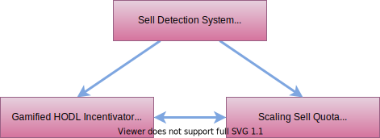
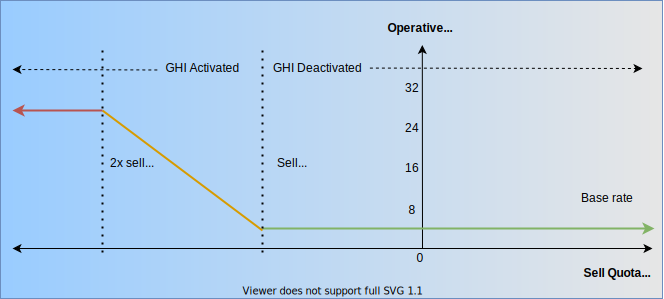

# 💰 Price Support Mechanism

The Price Support Mechanism (PSM) feature was introduced in SchnoodleV6 consisting of three subcomponents that work together to provide algorithmic resistance to major drops in price caused by sudden unexpected and external market conditions, or even ungraceful exits by whales.

## Sell Swap Detector

When Schnoodle was first launched, all transfers incurred fees. However, this was eventually found to be prohibitive for many of our buyers and existing holders due to the lack of adequate support for fee-on-transfer (FoT) tokens by Uniswap.

To address this, the Sell Swap Detector (SSD) was introduced that detects when a transfer is a sell swap, and to only apply a fee in those instances. This means that buys and even account-to-account transfers do not incur transfer fees! This also has the effect of reduced slippage requirement on buys, and lower gas fees compared to other reflective fee tokens.

SSD is simple but effective. It detects when the recipient of a transfer is the liquidity token. This inverts the transfer fee policy compared to other fee-on-transfer (FoT) tokens which operate on the basis of exclusive opt-out. Schnoodle operates on the basis of inclusive opt-in. As part of SchnoodleV7, this feature was further improved using the OpenZeppelin `AccessControlUpgradeable` base class which allows access roles to be specified, and for addresses to be assigned to those roles which can then be checked via the `isLiquidityToken` virtual function. The role `LIQUIDITY` is assignable to any number of liquidity tokens which means that Schnoodle may be listed on multiple exchanges with all liquidity tokens of those exchanges assigned the `LIQUIDITY` role.

## Scaling Sell Quota

The Scaling Sell Quota (SSQ) is an algorithm that tracks buys and sells, and maintains a sell quota that is the net of all buys and sells during consecutive 24-hour capture periods. This is more advantageous than a simple sell quota as the SSQ allows the sell quota to scale with both buy and sell volume.

To achieve this, each transfer checks the block.timestamp in a `TokenMeter` state variable called `_sellQuota`, and adds or subtracts the transfer amount to this variable also. Upon the first transfer after each 24-hour capture period lapses, this sell quota is reset to the current `block.timestamp` and a sell threshold (currently 1 billion SNOOD) which can also be changed via the DAO process depending on market conditions and the appetite of the community. This sell threshold ensures healthy price action on both the downside and upside. The timing of the reset (first transfer after 24 hours) ensures that each capture period is always more than 24 hours which means the capture period constantly shifts each day, so it is not unduly tied to any particular time zone and thus not prone to geographical regions capitalising on the sawtooth pattern of the SSQ.

The effect of the SSQ is that all sell swaps identified by the SSD incur transfer fees at a base fee rate (BFR) of 4% (distributed as BARK rewards) as long as the net sells do not exceed 1 billion SNOOD.

## Gamified HODL Incentivator

During periods of extreme sell activity (when the sell quota falls below zero), the Gamified HODL Incentivator (GHI) algorithm activates. At this point, the transfer fee escalates linearly with the sell quota by a rate escalator factor (currently adds 6x the BFR) at 2x the sell threshold at which point it is capped. Therefore, as the sell quota becomes more negative, the transfer fee increases. Conversely, as the sell quota becomes less negative, the transfer fee decreases. So, in theory, buys within a capture period after a sell-off could return the transfer fee to the BFR again. The transfer fee that applies at any point is called the operative fee rate (OFR). The chart below shows the GHI in action.

If the GHI is activated and the OFR increases, hodlers wanting to sell have three options:

1. Wait until the next 24-hour capture period before selling.
2. Wait for buys to come in which will de-escalate the OFR until it reaches the BFR.
3. Sell at a higher fee rate.

The expected effect of the GHI is that extreme sell-offs will be prevented because weak hands will be helped by Schnoodle hand-holding them through the tough times, and encouraging them to keep strong hands when everything else is "correcting".

## Summary

The Price Support Mechanism consisting of the above three constituent subcomponents is the first of its kind, and is designed to support the price through gamification without preventing people from selling, either by waiting for new buys, waiting for the next reset, or simply selling with higher tax during the game periods which are generally expected to be short-lived under normal circumstances whenever they happen.

The PSM is effectively a soft circuit breaker. [Circuit breakers](https://www.investopedia.com/terms/c/circuitbreaker.asp) are the complete temporary stopping of trading in the event of a drop in price. They are used on every major exchange in the world, and often work on a very short time frame like minutes.

Schnoodle goes a considerable step further with this softer version of it (the SSQ) where the price is allowed to drop any distance as long as matching buys have been made in the 24-hour capture period, plus the sell threshold, before increasing the fee rate. So, if there is a rally of net 5 billion SNOOD in a single day, a whale may sell 6 billion SNOOD at the BFR of 4%. And if net sells exceed 1 billion SNOOD in a day, then the GHI will activate and escalate the fee rate linearly, but also de-escalate it as buys continue to come in.

The impact the PSM has on whales is that they are encouraged to exit gracefully over a period of days rather than in one go, or wait until there is upside price action. In the event of a market correction, the PSM encourages all hodlers to limit their sells, and even encourages them to reconsider their divesting decisions once the markets have calmed down.

This is the entire method behind the PSM comprised of the SSD, SSQ and GHI. As long as people understand how it works, that it doesn't inhibit sales at the base rate if you exit gracefully as a wise investor should, and that it inherently hand-holds investors during market corrections, then investors will trust the nature of it. That is, that it is intended to soften any downside price action during sell-offs in the name of the project's future and to keep people holding and yield farming for the benefits they will receive in the form of utility as the project expands.
