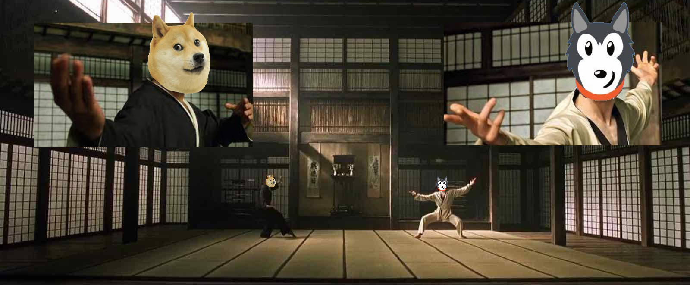
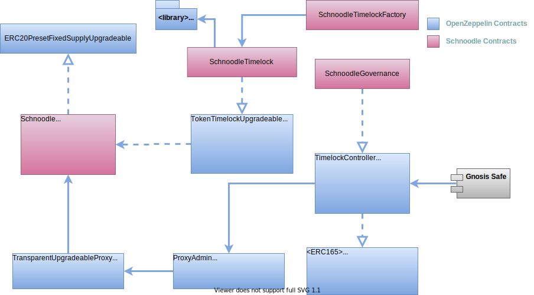

# Whitepaper

## The Schnoodle Story...

The story behind Schnoodle is unlike any other dog-themed coin. We realised that all the dog coins coming out one after another were just copy-paste contract clones of other tokens with some tweaks to the code to make it more lucrative for the dev team, add convoluted layers of abstraction to hide ruggability, etc.

_**Cool, so you jumped on the doggy bandwagon?**_

No. Our principal developer investigated what was really going on, and how he could apply his many dog years of experience as an algo programmer for the world's largest investment banks to this new DeFi movement that is taking the world by storm \(even Elon Musk is in on it\) to shape this into something more sustainable from the beginning, something that differentiates us from the rest in multiple ways that our hodlers would appreciate and understand.

_**And who's your principal developer?**_

His name is Jason – he has a glittering track record as a senior dev for many large British, American and Swiss banks while based in the financial centre of London, and is currently leading two IT divisions for the largest educational provider in the Netherlands.

But his online name is [Neo](https://twitter.com/XtreemX), and this is where it gets interesting...

_**Tell me more...**_

Last year, a DeFi project known as RFI was incepted by [Reflect Foundation](https://reflect.finance/) for which the contract code was developed by the notorious developer known as Morpheus. Do you see where we're going with this? 😉 The project became controversial as the code was copyrighted, but he eventually [open-sourced](https://github.com/reflectfinance/reflect-contracts/blob/main/contracts/REFLECT.sol) it. The contract can be found [here](https://etherscan.io/address/0xa1afffe3f4d611d252010e3eaf6f4d77088b0cd7#code).

The key idea behind this code is that it contains a complex algorithm using lots of complex states to "reflect" a different balance to holders that includes a distribution of fees from other transfers. In other words, whenever the token is sold, a fee is charged and distributed algorithmically to all other holders.

Copies of this code were then used as the basis of [SAFEMOON](https://www.bscscan.com/address/0x8076c74c5e3f5852037f31ff0093eeb8c8add8d3#code), and the dog meme coin [HOKK](https://etherscan.io/address/0xc40af1e4fecfa05ce6bab79dcd8b373d2e436c4e#code).

_**So, lemme guess. Neo wanted to kick Morpheus' ass?**_



In analysing this code, Neo noticed that there were numerous inexcusable flaws that simply indicated laziness and haste on the part of the devs. Absolutely no care had been taken to ensure hodlers were given the best deal in terms of gas fees and potential ruggability. There are functions that allow the contract owner to include and exclude addresses from the fee process at will. How is this fair to other hodlers? And the code for SAFEMOON was compiled with Solidity 0.6.12 which was already over 7 months old at the time of launch when Solidity was _already_ at version 0.8.1. This may not sound hugely important, but it takes very little effort to use a more recent version, and this would have afforded some code tweaks that would result in less gas fees for hodlers.

Not only that, but the devs didn't even enable optimisation on deployment \(as can be seen at the top of the contract page\). Again, highly lazy, or just plain incompetence, and it's the hodlers who suffer.

HOKK was released more than a month later and made no such improvements. Just a straight copy of the RFI code, and another marketing campaign to get another batch of unsuspecting dog meme coin hunters aping into their dog poo coin.

_**OK, sounds like a gravy chain, but dogs love gravy on their food, right?**_

Perhaps, but Crufts dogs like gourmet. So, Neo got to work and set out to rewrite Morpheus' reflective algorithm from the ground up \(not using a single line of code from the RFI contract or any other dog meme coin\), and to ensure that he would use the best techniques, practices and leading-edge technologies the blockchain space has to offer. And so, Schnoodle was born, like a cute little puppy ready to change the world.

## Schnoodle Creation

### The BARK Algorithm

Neo's algorithm does away with the complexities of the RFI algorithm which stores two sets of balances for hodlers, in `_rOwned` and `_tOwned`. Instead, it uses a simple global rewards wallet created during contract deployment with a random address whose private key can never be known \(and therefore inaccessible to anyone or anything but the contract\), and then simply adds a proportion of this wallet to the hodler's balance in an overridden implementation of the `balanceOf` function. The algorithm is simple but smart:

$$balance + fees × balance ÷ (totalSupply - fees) - rewardsSpent$$ 

`balance` is your burnable balance \(can be retrieved with the `balanceOfBurnable` function\). `fees` is the value of the global rewards wallet. `rewardsSpent` are of course the rewards you've already spent \(you can't benefit from them twice, you greedy dog 😉\). The formula basically ensures that you are dynamically allocated a portion of the rewards wallet proportionate to your burnable balance relative to the total supply less fees. And the rewards wallet of course accumulates tokens on each transfer where a fee percentage is charged.

_**Simple but effective. But how do we spend our fee rewards instead of our burnable balance?**_

Good point! We handle this for you automatically. The `_transfer` function is smart in that it ensures the hodler's fee rewards are used **first** in any transfer. This has the effect of preventing all hodlers' fee rewards theoretically diminishing to zero before they are ever sold.

As the distribution of **rewards** to hodlers is completely **automated** within the smart contract on the **blockchain**, we call this the BARK algorithm. Blockchain Automated Reward Kickbacks. **Kickbacks** because it's the only word we could think of to make it into a dog-related acronym.

_**OK, it's neat, but it's not exactly the same as the RFI algorithm, right?**_

Correct. The effect is different to the RFI code insofar as new hodlers immediately get a proportion of the rewards, but the normal liquidity pool algorithms will ensure that the benefit of rewards and the positive price impact to existing hodlers outweigh any reduction in their reward tokens. And a hodler selling their tokens will of course deplete the rewards wallet, but they are incentivised to not do so because 1\) they pay a fee, and 2\) more importantly, their stash will grow organically when other hodlers sell _their_ tokens. And so long as the number of hodlers continues to grow, the continuous redistribution of fees to hodlers combined with the increasing token value will of course benefit hodlers more generously the longer they have held. The lack of exclusion functions means that even the LPs and the liquidity tokens themselves are subject to the exact same fees and rewards system.

The above effectively results in a completely fair cat-and-mouse game, game theory built into the tokenomics of the contract if you will, where ultimately and ironically the dog wins. And that means anyone hodling SNOOD tokens for as long as Schnoodle remains a going concern \(more on that later as we talk about it becoming a true DAO in its future roadmap\).

_**That sounds totally fair to hodlers. What about the contracts?**_

### The Smart Contracts

As already mentioned, existing RFI-based tokens and dog meme coins use archaic technologies and lazy or bad practices. And by 'archaic', that's unnecessarily using technology that's been superseded more than 6 months prior, and in blockchain, 6 months is of course a very long time.

This is why Schnoodle uses the latest [OpenZeppelin Contracts](https://openzeppelin.com/contracts/) library which is a respected and established base on which any Ethereum smart contract worth its salt is based upon. Schnoodle goes a step further and leverages the preset contract `ERC20PresetFixedSupplyUpgradeable` which provides OOTB standardised ERC-20 functionality such as transfer, approval, balance, total supply, and basic token details functionality, as well as burning and upgradeability of the contract \(more on that later\). This means that hodlers can be sure that the base contracts that Schnoodle subclasses are tried, tested and even audited.

And the way the contracts are deployed is as separate files under the same contract \(not flattened\), which makes it easier for you \(if you want to\) to focus on the actual business logic of the Schnoodle smart contract, and not have to worry about the basic standard functionality containing a potential exploit or other hidden "easter egg". What you see is what you get, basically.

_**Great you're using the latest tech. What about the Schnoodle code itself?**_

Indeed. Well, the Schnoodle smart contract is compiled with the latest version of Solidity \(0.8.5 at the time of writing\) to ensure maximum efficiency in terms of gas fees, and to eliminate any possibility of known bugs in the compiler potentially leaving the contract open to exploit \(unlikely, but the safety of hodlers' funds is Schnoodle's absolute priority, no matter how remote any given risk is\). By way of a simple example, take the RFI code that SAFEMOON and HOKK both use:

```text
x = x.sub(y)
```

`sub` is a `SafeMath` function to eliminate overflow errors. In the latest versions of Solidity, this gas-intensive operation simply isn't necessary anymore. And it means the temporary assignment in memory of `x` prior to calling `sub` is also not necessary because the subtraction assignment operator can be used which is already optimal without the optimiser running on it further \(which, as noted earlier, the RFI-based tokens don't even enable\). So, this is what Schnoodle does instead:

```text
x -= y
```

Same outcome, way simpler, far less gas. And quite simply, beautiful, lean and clean.

_**So, you launch Schnoodle and add liquidity to Uniswap. How do we know it won't be rugged?**_

### Locked Liquidity

Unlike other dog-themed and RFI-based coins, Schnoodle is intended to be trustless. This means that there is no requirement for you to trust that the team will do what it promises, as we ensure that everything is in the code. This ensures that you have the confidence to use Schnoodle without being concerned about promises not being fulfilled.

This is why we use the tried-and-tested OpenZeppelin [`TokenTimelock`](https://docs.openzeppelin.com/contracts/4.x/api/token/erc20#TokenTimelock) contract to lock the initial liquidity for a minimum of 6 months in our `SchnoodleLiquidityTimelock` contract. We hope by that time, there will be enough LPs to make the pool liquid enough for this to no longer be a concern. But if that's not the case, then we will of course lock our liquidity for another 6 months before the first 6 months lapses. And we will advertise this on all our channels including [Telegram](https://t.me/SchnoodleFinance).

Locked liquidity for 6 months gives peace of mind for hodlers, and eliminates ruggability even further.

And for completeness, we use the same technique to lock staking pool and community tokens in our `SchnoodleStakingTimelock` and `SchnoodleCommunityTimelock` contracts respectively.

Schnoodle is now truly destined to be man's best friend.

_**I'm sold. But you said something earlier about upgradeability...**_

### Upgradeability

Yes. Well, the idea is that the state of Schnoodle on launch is not the do all and end all. While we have gone to painstaking measures to ensure the initial Schnoodle smart contract has everything it needs to function as a fully tested production-ready coin, we have big plans for Schnoodle because we believe it will change the face of dog-themed tokens into something far greater than others trying to join the gravy train.

We have made it upgradeable.

_**But the blockchain is immutable. Upgrading a smart contract means all hodlers must undergo a token swap, right?**_

Not quite. Using the OpenZeppelin Contracts, we utilise a concept known as a proxy contract known as `TransparentUpgradeableProxy`. All interactions with Schnoodle go via this proxy, and if you view the proxy contract on Etherscan, you will even notice two additional buttons on the _Contract_ tab: _Read as Proxy_ and _Write as Proxy_. These show the ABI of the underlying implementation contract \(`Schnoodle`\) to which there is a link on the respective 'proxy' pages.

The beauty of this is that the `Schnoodle` smart contract can be upgraded in the future without changing the contract address because the proxy contract never changes. And due to the immutability of blockchain, the existing state can never be changed. We can only add new state.

And the linchpin to the proxy contract and the implementation contract is a third contract known as the `ProxyAdmin` contract. It is through this contract that all upgrades are conducted.

_**Wow; sounds great. But doesn't that mean you could change Schnoodle into a less desirable dog, such as a Poodle or a yappy Chihuahua?**_

Well, that's where we've gone the extra mile \(we're halfway to the moon right now, to be fair\), and implemented governance into Schnoodle in the form of `SchnoodleGoverance` smart contract which implements the ERC-165 standard.

_**Awesome. How TF does that work?**_

This is basically a smart contract to which ownership of the aforementioned `ProxyAdmin` contract is transferred upon creation. And it derives from the OpenZeppelin `TimelockController` base contract to delay upgrades to the `Schnoodle` contract by a minimum time period so that hodlers can view the upgrade on the blockchain before it becomes effective. If hodlers don't like it or find a problem with it, they can take action straight away, or we can cancel the upgrade.

_**Cool. But you can still ignore us, right?**_

### Multisig

We would never do that. But, as an additional layer of protection, we have added multisig to the process using [Gnosis Safe](https://gnosis-safe.io/). This means that upgrades cannot happen without multiple parties signing the change. Under the covers, `SchnoodleGovernance` is deployed with the proposer and executor of actions on the contract set to our Gnosis Safe address where multiple signatory wallets are required for signing contract interactions such as upgrades. This protects you the hodler against unilateral decisions or, even worse, leaked private keys like [what happened with PAID Network](https://youtu.be/v28yihfpP_E).

_**This all sounds really complicated. Explain again, like I'm a 2-year-old dog.**_

Right. So, the `Schnoodle` smart contract is deployed to the Ethereum blockchain along with three other contracts:

* `TransparentUpgradeableProxy`: All interaction with Schnoodle is done via this proxy.
* `ProxyAdmin`: Any upgrades can only be done via this contract which is owned by...
* `SchnoodleGovernance`: This executes 'upgrade' calls on _ProxyAdmin_ but only after a minimum time period has elapsed \(set in the contract\). And this contract can only be interacted with by our Gnosis Safe address.

In the event of an upgrade, the following steps take place:

1. The new `Schnoodle` contract version \(say, `SchnoodleV2`\) is prepared with the proxy \(this means it's not yet active, but _ready_ to activate\).
2. Then, the scheduled upgrade is signed off by the multi-signatory wallets at the Gnosis Safe address and broadcast to the blockchain.
3. After the minimum required timelock has elapsed as per `SchnoodleGovernance`, the upgrade is executed at the Gnosis Safe address, again requiring sign-off by the multi-signatory wallets, and broadcast to the blockchain.
4. Any scheduled or executed upgrades can be seen in the event log of the proxy contract.

With this comprehensive and highly sophisticated process, it now means we have two solid layers of protection for our hodlers: upgrade timelock protection and multisig.



_**I love it. But I still have a niggle. What if the whole team mutinies or goes rogue?**_

Well, in reality, this would only happen if we were savagely attacked by flesh-eating dog zombies, and we turned into said dog zombies ourselves bent on destroying all humans. But we hear you. Enter, Schnoodle DAO...

### Schnoodle DAO

This is where we will be turning our attention to the long-term roadmap of Schnoodle and making it into the first true DAO of the blockchain where upgrades will only be permitted if the hodlers vote in favour of them. And this will be a fully automated process to really put the 'A' in DAO.

This makes use of an extended feature of Gnosis Safe known as [SafeSnap](https://github.com/gnosis/dao-module) through which any upgrade proposals must be made. This acts as the linchpin between two other platforms known as [Snapshot](https://snapshot.org/#/schnoodle.eth) and [reality.eth](https://realit.io/).

_**Wow! Three more blockchain platforms in the mix. Schnoodle really is the dog's bollocks, right?**_

Right. But they all serve an important purpose. Our Snapshot space is where proposals are listed and can be voted on by hodlers. This voting mechanism is off-chain thus saving you gas. Voting is free unlike many other quasi-DAO platforms such as Aragon, DAOstack, Colony and Compound.

_**Free as in beer? But doesn't that come at the expense of a measure of decentralization?**_

Right. Which is where reality.eth comes in. This is essentially a very cool escalation-game-based oracle that SafeSnap uses to allow trustless, on-chain execution based on the outcome of the off-chain votes.

The science bit... _**\(Huh? I thought we'd passed the science bit!\)**_

The Schnoodle Snapshot space is connected to the SafeSnap DAO module instance using the SafeSnap plugin via the Snapshot space settings where the address of the DAO module instance is specified. Access-control logic for the DAO module instance is enabled to execute transactions on our Gnosis Safe account using the [`Transaction Builder`](https://help.gnosis-safe.io/en/articles/4934427-add-a-module) app in Gnosis Safe.

_**Umm, OK. So, can I finally make a proposal?**_ 💍

Yes! Proposals to execute an upgrade \(on `ProxyAdmin`\), which can be done by anyone including you, can now be made via Snapshot where off-chain votes are gathered. Once voting has closed, a question is placed on reality.eth asking if the proposal passed. This question is posed for 24 hours before the outcome may be finalised. The question may be answered by anyone with the placement of a bond in ETH.

If the vote is in favour and the reality.eth question confirms this, reality.eth can then be triggered \(via a button in Snapshot, by anyone\) to execute the upgrade via Gnosis Safe \(which, as explained earlier, is connected to `ProxyAdmin` via `SchnoodleGovernance` which is the owner of `ProxyAdmin` which can therefore only be interacted with by our Gnosis Safe account\).

_**This sounds brilliant! But aren't you worried about hodlers making a dog's dinner of everything?**_

Well, with great power comes great responsibility. But that power needs to be earned. So, in the beginning, while everything is autonomous, if we could see that something really bad was about to happen \(an upgrade with a serious flaw that no one noticed, or some sort of hodler 51% attack\), then the multisig owners can step in and intervene during the 24-hour cooldown period and prevent execution of the upgrade.

_**Phew! OK, but then it's still not really fully decentralised then, is it?**_

Not fully, but once the team are confident that the hodlers are responsible, and there are enough of them to prevent malicious attacks, then the team will remove themselves as multisig owners from the Gnosis Safe. At this point, Schnoodle becomes the world's first truly progressive DeFi DAO, and we really put the 'D' in DAO.

_**Oh, wow. I'm so excited, my tail is wagging like a metronome!**_

For comparison, there are several well-known projects such as Yearn, Sushi, Balancer, Aave, DIA and Synthetix that use Gnosis Safe and Snapshot to gather off-chain votes, with a team "promise" that they will execute proposals voted for.

By using SafeSnap on top of this, Schnoodle becomes completely autonomous once a proposal goes in. This puts Schnoodle technologically way ahead of all the aforementioned projects, not to mention other meme coins. And once our multisig ownership is removed completely, then it becomes truly 100% a DAO.

And we are already developing this part of the project on the Ethereum testnet known as Rinkeby. This is because SafeSnap is also only available on Rinkeby at present because it really is truly bleeding-edge technology. However, once it's in mainnet, the outlook is that we'll be ready to ship it straight away and be the first progressive DeFi DAO on the blockchain! 🚀

_**WOOF!!**_

## Future Roadmap

As if all that isn't enough, we also have other plans for Schnoodle, but the details of this are still being fleshed out and will be in a subsequent version of the whitepaper. But in short, these are the two main milestones you can look forward to in 2021:

1. Staking – stake your SNOOD tokens for additional rewards.
2. NFT rewards – receive Schnoodle NFTs just for staking your SNOOD tokens.

