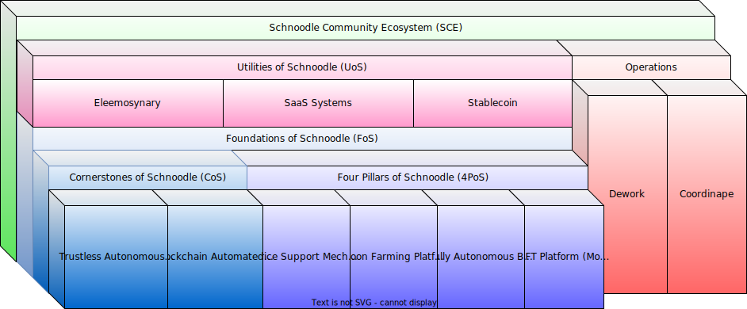

# 🫂 Community Ecosystem

The Schnoodle Community Ecosystem (SCE) is comprehensive, but is structured in such a way as to be easily understandable and digestible by any would-be investor in SNOOD. The following block diagram shows this structure followed by a brief overview of the main parts.

### Technology

First, is our technology. This comprises the Foundations of Schnoodle which are formed from the two Cornerstones and Four Pillars of Schnoodle. You can read about these here:


[foundations-of-schnoodle.md](foundations-of-schnoodle.md)


### Use Cases

Second, are our use cases. This comprises the Utilities of Schnoodle which are built on the Foundations of Schnoodle. You can read about these here:


[utilities-of-schnoodle.md](utilities-of-schnoodle.md)


### Operations

Third, are our operations. As a DAO, our backlog is completely transparent, and everyone can be a part of it. This means that, as well as earning SNOOD from BARK and MFP, you can also earn SNOOD by completing tasks for Schnoodle. You can view our full backlog and get involved on Dework here:



## Social Media

Social media of course forms a huge part of our community, and the community should be actively involved in this. For this reason, we use [Dework](https://app.dework.xyz/schnoodle-dao-1) to allow community members to submit social media posts for the circle to then post on our various channels including [Twitter](https://twitter.com/SchnoodleDAO), [Instagram](https://instagram.com/schnoodledao), [Facebook](https://www.facebook.com/SchnoodleDAO), [LinkedIn](https://www.linkedin.com/company/schnoodle), and [TikTok](https://www.tiktok.com/@schnoodledao).

Please look out for tasks in the [Marketing project of Dework](https://app.dework.xyz/schnoodle-dao-1/marketing-63) where you can make a submission in return for a bounty reward. The following information should be referred to when making submissions.

### Acceptance Criteria

Submissions must include visual content in at least one of the following formats:

* 1280x720 (16:9) also known as [720p](https://en.wikipedia.org/wiki/720p) or HD
* 1920x1080 (16:9) also known as [1080p](https://en.wikipedia.org/wiki/1080p) or FHD
* 720x720 (1:1) if intended for Instagram

Ideally, both 16:9 and 1:1 formats should be included.

The following should also be adhered to:

* Include a caption to go along with the content. All text must be in good English with no typos and correct grammar.
* Include relevant hashtags, and the cashtag $SNOOD for Twitter.

Please see our social media channels for examples of the quality that is expected. Submissions should adhere to our branding guidelines (link below). Our logo, colours, and/or mascot should be used wherever possible.


[broken-reference](broken-reference/)


### Approval Process

Visual content should be attached to the submission (file drag-and-drop is supported).

Multiple submissions can be eligible for a bounty. This is not a competition. If your submission is approved, a circle member will schedule it to be posted to our channels using Loomly. If your submission is rejected, you can improve and resubmit no problem. Feel free to discuss your submission in Discord using the ‘Discuss’ button on the task where we can discuss why it was rejected and how it can be improved.

Note that if your submission is rejected, you can still see it in the activity feed on the task.
