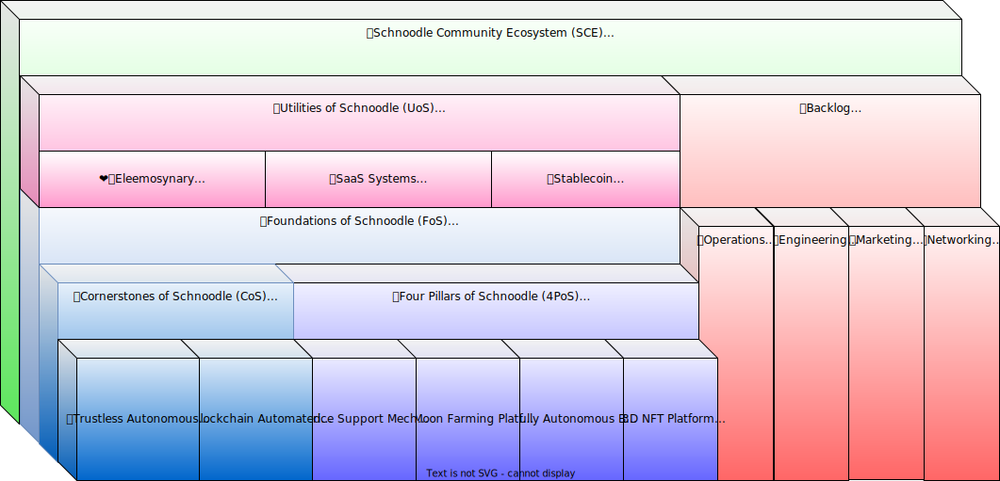

# 🫂 Community Ecosystem

The Schnoodle Community Ecosystem (SCE) is comprehensive, but is structured in such a way as to be easily understandable and digestible by any would-be investor in SNOOD. The following block diagram shows this structure followed by a brief overview of the main parts.

A significant component of the SCE is our core technology which comprises the Foundations of Schnoodle formed from the two Cornerstones of Schnoodle and the Four Pillars of Schnoodle. On top of our core technology, we build the Utilities of Schnoodle. You can read about all of this in the following sections:


[foundations-of-schnoodle.md](foundations-of-schnoodle.md)



[utilities-of-schnoodle.md](utilities-of-schnoodle.md)


## 📚 Backlog

As a DAO, our backlog is completely transparent, and everyone can be a part of it. We consider this the cradle of our community. This means that, as well as earning SNOOD from BARK and [MFP](../features/mfp.md), you can also earn SNOOD by completing tasks for Schnoodle. You can view our full backlog and get involved here:



All tasks should be self-explanatory with a full description including acceptance criteria which will be used to determine if the task is complete. Each task may be discussed in its own thread on Discord by pressing the **Discuss** button on the task. If you apply to work on a task, then that application may also be discussed in a private Discord thread with the reviewer(s) by pressing the **Discuss application** button.

However, there are certain types of task that have some special treatment, and this is indicated by tags. The following sections describe these types of task. Tasks with these tasks will make it clear in their descriptions that special rules apply.

### 🎭 Social Media

Social media of course forms a huge part of our community, and the community should be actively involved in this. For this reason, we use [Dework](https://app.dework.xyz/schnoodle-dao-1) to allow community members to submit social media posts for the team to then post on our various channels including [Twitter](https://twitter.com/SchnoodleDAO), [Instagram](https://instagram.com/schnoodledao), [Facebook](https://www.facebook.com/SchnoodleDAO), [LinkedIn](https://www.linkedin.com/company/schnoodle), and [TikTok](https://www.tiktok.com/@schnoodledao).

Please look out for tasks in the [Marketing project of Dework](https://app.dework.xyz/schnoodle-dao-1/marketing-63) where you can make a submission in return for a bounty reward. The following information should be referred to when making submissions.

#### Acceptance Criteria

Submissions must include visual content in at least one of the following formats:

* 1280x720 (16:9) also known as [720p](https://en.wikipedia.org/wiki/720p) or HD
* 1920x1080 (16:9) also known as [1080p](https://en.wikipedia.org/wiki/1080p) or FHD
* 720x720 (1:1) if intended for Instagram

Ideally, both 16:9 and 1:1 formats should be included.

The following should also be adhered to:

* Include a caption to go along with the content. All text must be in good English with no typos and correct grammar.
* Include relevant hashtags, and the cashtag $SNOOD for Twitter.

Please see our social media channels for examples of the quality that is expected. Submissions should adhere to our branding guidelines (link below). Our logo, colours, and/or mascot should be used wherever possible.


[Broken link](broken-reference)


#### Approval Process

Visual content should be attached to the submission (file drag-and-drop is supported).

Multiple submissions can be eligible for a bounty. This is not a competition. If your submission is approved, a team member will schedule it to be posted to our channels using Loomly. If your submission is rejected, you can improve and resubmit no problem. Feel free to discuss your submission in Discord using the ‘Discuss’ button on the task where we can discuss why it was rejected and how it can be improved.

Note that if your submission is rejected, you can still see it in the activity feed on the task.

### ⏳ Timelocked

These tasks typically have a high bounty, and represent work that is critical to the operations of Schnoodle. Anyone may participate in such work, but because of the level of reward, they require active engagement with the team, and may even require you to _become_ a member of the team, whether temporarily or long-term.

As a result of this, these tasks require SNOOD payments to be timelocked for a period after payment. The timelock period will be in the task description. The nature of this timelock is a requirement for the user to lock their tokens in a farm on our [Moon Farming Platform](../features/mfp.md) using the Autofarm (AF) feature, a feature we consider to be cool AF. All you have to do to autofarm is enable this on your Ethereum account via the Schnoodle X DApp specifying the vesting and unbonding blocks. All subsequent transfers to your account will then autofarm with these parameters including the payment for your task.
